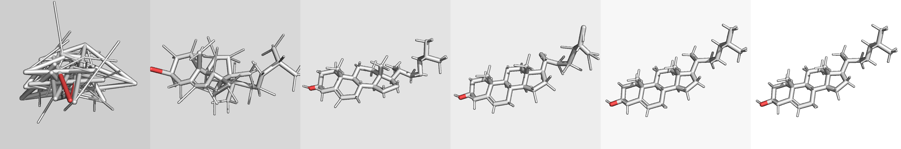
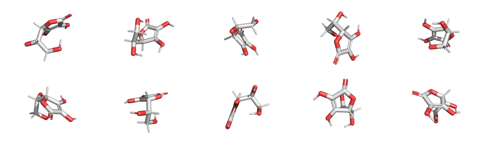
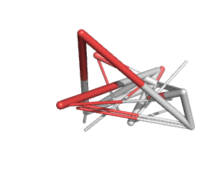
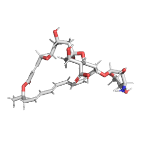

# Physics-informed generative model for drug-like molecule conformers

This package provides an implementation of the
generative model as described by the article:

* Williams, D.C. and Inala, N. "Physics-informed generative model for drug-like molecule conformers."
[https://arxiv.org/abs/2403.07925](https://arxiv.org/abs/2403.07925),
[10.1021/acs.jcim.3c01816](https://pubs.acs.org/doi/10.1021/acs.jcim.3c01816)

## Requirements

This repository was tested with Python 3.10 and the following nonstandard packages:

| Package | Release |
| ------- | ------- |
| PyTorch | 1.12.1 &emsp; 1.13.0 &emsp; 2.0.0 &emsp; 2.0.1 |
| RDKit | 2021.09.2 &emsp; 2022.09.5 |
| sqlite3 | 2.6.0 |
| NetworkX | 2.4 |
| NumPy | 1.23.4 |
| Pandas | 1.3.5 |
| tqdm | 4.57.0 |

## Generation

### Single molecule

The ```generate_one.py``` script can be used to generate multiple conformers for 
a single molecule represented as an isomeric SMILES string. For example:

```
> ./generate_one.py "C([C@@H]([C@@H]1C(=C(C(=O)O1)O)O)O)O"
```

This should produce the output file ```output/output.sdf``` with contents
that look something like the following:



For best results, use isomeric SMILES, which provide explicit tetra chirality
and cis/trans isomerism.

By default, the generator uses the model trained on QMugs, which is provided
by this repository in the ```checkpoints``` directory. The model trained on 
GEOM-drugs is also available. Or you can train your own model (see instructions below).

By default, ten conformers are generated, using the CPU. Alternatives are
available using command line options. Depending on
hardware, employing a GPU could be faster, especially for a larger number
of conformers or a particularly large molecule.

By default, only the final conformers are saved. The ```-trace``` option
is provided if you wish to inspect intermediate solutions created 
during generation. Provide this option with a filename prefix, and the
script will save a molecule file for each generated conformer that includes
each step by appending an integer to the prefix. For example:

```
> ./generate_one.py "C([C@@H]([C@@H]1C(=C(C(=O)O1)O)O)O)O" --trace output/frame
```

produces ten files ```output/frame000.sdf```, ```output/frame001.sdf```, etc.
The following is an animation created from an example of one of these files.



If you want to use guided generation using the simple repulsive term
as described in the article, apply the ```--repulsion``` option.
This can be useful for some difficult examples, such as natamycin,
which contains a macrocycle.

```
> ./generate_one.py "C[C@@H]1C/C=C/C=C/C=C/C=C/[C@@H](C[C@H]2[C@@H]([C@H](C[C@](O2)(C[C@H](C[C@@H]3[C@H](O3)/C=C/C(=O)O1)O)O)O)C(=O)O)O[C@H]4[C@H]([C@H]([C@@H]([C@H](O4)C)O)N)O" --repulsion 0.5
```



### Many molecules


The ```generate_many.py``` script can be used to generate multiple conformers for 
many molecules. The input should be a space-separated file containing one molecule per
line with the first column the isomeric smiles and the second column a unique molecule
name. The name is used to generate the output sdf files in the given directory.

```
> ./generate_many.py example.smi 
100%|████████████████████████████████████████████████████████████████| 3/3 [00:00<00:00, 921.89it/s]
> ls output
aspirin.sdf  viagra.sdf  vitamin_C.sdf
```

By default, ten conformers are generated for each molecule, using the CUDA library. 
Batching is used to generate molecules in parallel. Use the ```--batch``` option to increase
or decrease the number of batched atoms to match the memory limitations of your
hardware.


## Training

### Data preparation

The provided training code expects the input conformers to be in a standard
format, stored in a sqlite3 database. The script ```build_source.py``` can
be used to build a database. For QMugs and/or GEOM-drugs, download the source
data, edit the script appropriately (to point to where you have stored
the files), and then invoke it. Creating the database is a one-time step
that will take a few hours, depending on the speed of your system.

| Data set | Download link |
| -------- | ------------- |
| QMugs | https://libdrive.ethz.ch/index.php/s/X5vOBNSITAG5vzM |
| GEOM-drugs | https://dataverse.harvard.edu/api/access/datafile/4327252 |

The script is fairly simple and can be modified for other conformer sources.

### Training

Training is performed using the ```train.py``` script.

```
> ./train.py data/qmugs.db
```

Depending on resources and the size of the dataset, training can take between 
a few hours or several days. A GPU or TPU is recommended. Adjust the batch size 
to match your memory resources. Performance may be limited by the speed 
of the file system containing the sqlite3 database. If you are in a hurry,
using a portion of the dataset or fewer epochs will produce a useable model for
experimentation, although accuracy may suffer to a degree.

### Probing

Probing the structure of a model requires an example
molecule and some careful accounting. An example is available
in ```probe.ipynb```.


